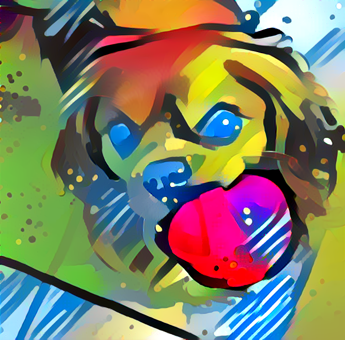
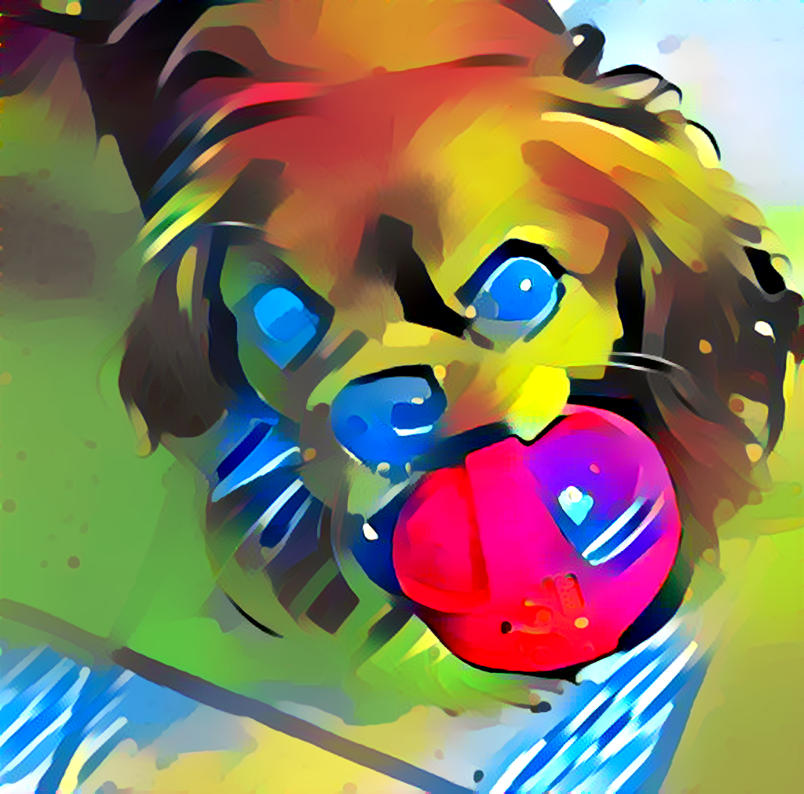

# Neural-Style-Transfer
This is the codebase for Neural style transfer. Here I have worked on generating smoother high-quality style transferred images using the mentioned repositories.

The two folders contain the modified codebase of the referred repositories.
- neural-style-pt
   - This folder contains the final modified code from [2]. (Added different weights for different style layers)
   - I includes some of the features from [1] as well and the default parameters have been changed to be in sync with the folder2
   - Can be used for generating high quality and resolution output.
- PytorchNeuralStyleTransfer
   - This folder contains important tests and serves as a test bed for trying different style transfer hyperparameters.
   - This is also a bit modified version of [1]. (Added TVLoss)
   - Can be used for educational purposes to understand the depths of Style Transfer.

Both of these are working and you can read the respective README.md for more details. Both of these implementations are in **pytorch**.

Here are of the **generated results** using the given codebase.<br>


<br>


### Replicate the generated results
First clone the repo.
- Image 1
```
cd neural-style-pt
python neural_style.py -content_image ../my_test/content.jpg -style_image ../my_test/style.jpg -output_image ../out.png -style_scale 1.0 -image_size 700 -gpu 0 -save_iter 1000 -print_iter 100 -num_iterations 1000

```

- Image 2
```
cd neural-style-pt
python neural_style.py -content_image ../my_test/content.jpg -style_image ../my_test/style.jpg -output_image ../out1.png -style_scale 1.0 -image_size 1024 -gpu 0 -backend cudnn -cudnn_autotune -save_iter 1000 -print_iter 100 -num_iterations 1000

```

### References
1. https://github.com/leongatys/PytorchNeuralStyleTransfer
2. https://github.com/ProGamerGov/neural-style-pt
